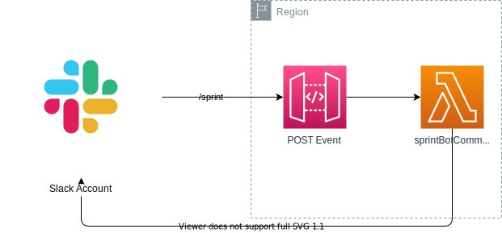
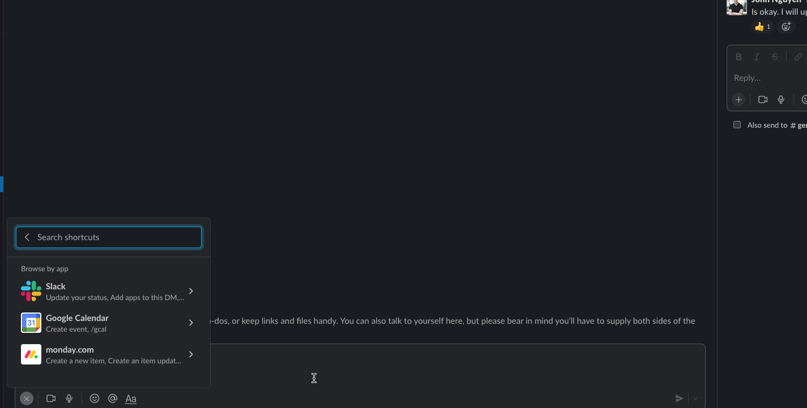

# Slack Haiphen

This is a slash command using `/haiphen`.

## Tech Stack

- Amazon API Gateway and AWS Lambda
- [Boltjs](https://slack.dev/bolt-js/tutorial/getting-started) as Slack SDK
- [Projen](https://github.com/projen/projen) as Infrastructure as code

## Deployment



### Pre-requisite

- AWS Account

```bash
npx projen deploy
```

## Demo

<a href="https://slack.com/oauth/v2/authorize?client_id=3646067385254.4086174160645&scope=commands&user_scope="></a>

